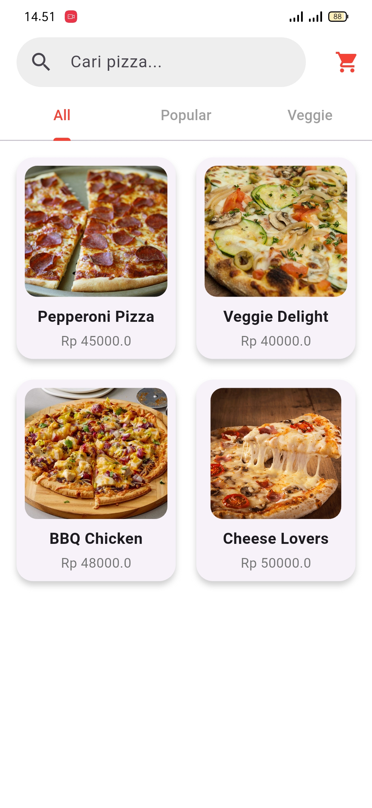
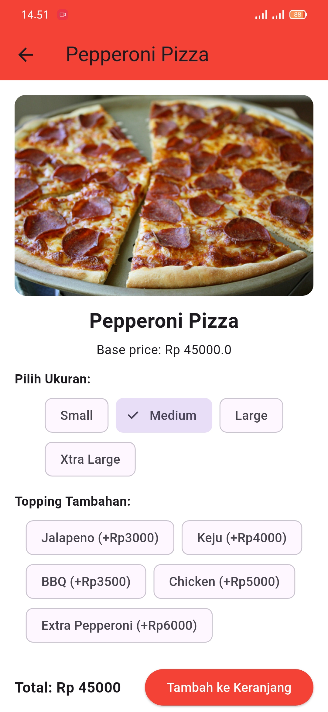
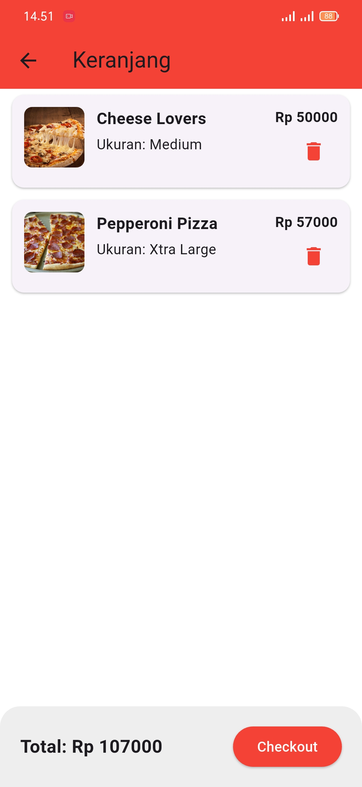
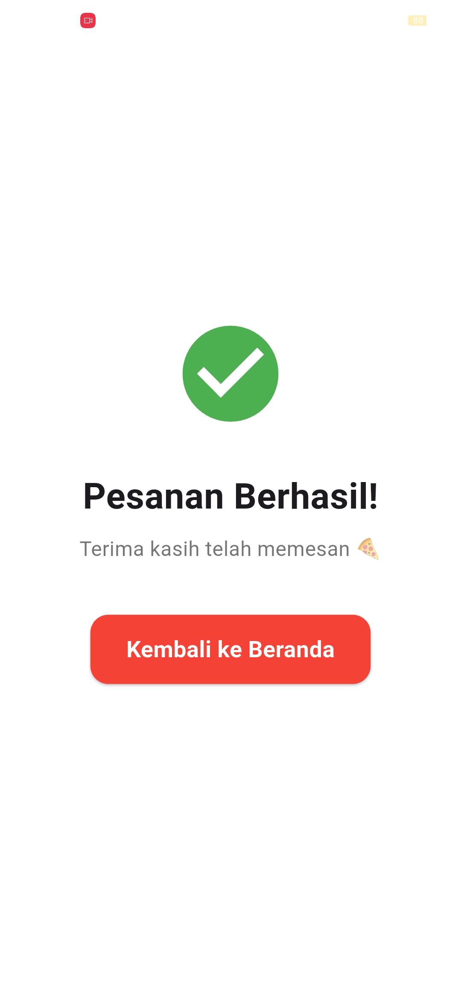

# 🍕 Pizza Order App  
**Tugas Pemrograman Mobile II**

**Dibuat oleh:**
- **Alvin Nurfaiz**
- **Rizal Nugraha**

---

## 📌 Deskripsi Aplikasi

**Pizza Order App** adalah aplikasi pemesanan pizza sederhana yang dibangun menggunakan **Flutter** dan **Provider** sebagai state management.  
Aplikasi ini memiliki fitur pemilihan ukuran pizza, topping tambahan, perhitungan harga otomatis, menambah pesanan ke keranjang, dan halaman checkout dengan tampilan animasi yang halus.

Aplikasi ini dibuat untuk memenuhi tugas mata kuliah **Pemrograman Mobile II**, dengan fokus pada:
- Penggunaan state management  
- Navigasi dan routing  
- Pembuatan UI responsif  
- Animasi overlay custom

---

## 📸 Screenshot Aplikasi

### 🏠 Home Page
Menampilkan daftar pizza, pencarian, dan tombol menuju keranjang.  

### 🔍 Detail Page
Halaman untuk memilih ukuran pizza dan topping tambahan.  

### 🛒 Cart Page
Menampilkan item pesanan, total harga, dan tombol checkout.  

### ✅ Success Page
Halaman konfirmasi pesanan berhasil dilakukan.  

---

## 📥 Dokumentasi

record aplikasi dapat di akses melalui link berikut:

👉 **https://drive.google.com/file/d/13gjAF2aUXNWgjw_h_HUDweCjBrAhKyoR/view?usp=sharing**  

---

## 🧰 Teknologi yang Digunakan

- **Flutter 3.x**
- **Provider (State Management)**
- **Dart**
- **Material Design**
- **Custom Overlay Animation**

---

## ✨ Fitur Utama

### 🧱 1. Pemanfaatan Stateless & Stateful Widget
Aplikasi ini menggunakan kombinasi **StatefulWidget** dan **StatelessWidget** sesuai kebutuhan:
- **StatefulWidget** digunakan pada halaman yang membutuhkan perubahan UI secara dinamis, seperti:
  - `PizzaDetailPage` → untuk update harga, ukuran, topping secara realtime.
- **StatelessWidget** digunakan pada halaman yang hanya menampilkan UI tanpa perubahan state internal, seperti:
  - `HomePage`  
  - `CartPage`  
  - `OrderSuccessPage`

### 📜 2. Menampilkan Data dengan ListView
Aplikasi ini menggunakan **ListView.builder** untuk menampilkan data pizza dan data keranjang karena:
- Lebih efisien menangani list panjang
- Hanya item yang terlihat di-render

Digunakan pada:
- List pizza di `HomePage`
- List item keranjang di `CartPage`

### 🧩 3. Penggunaan GridView
Aplikasi ini **tidak menggunakan GridView**, karena desain daftar pizza menggunakan layout list untuk tampilan lebih sederhana dan fokus pada tiap item.

### 🛠️ 4. Custom Widget & Komponen Reusable
Aplikasi ini juga menerapkan beberapa komponen custom untuk mempercantik tampilan dan menjaga kerapihan kode:

- **Custom Toast Animation**
  - Dibuat dengan `OverlayEntry`, `AnimationController`, dan `Transform`
  - Dipakai saat menambahkan item ke keranjang  
  → File: `pizza_detail_page.dart`

- **Card Item Pizza (Home Page)**
  - Meskipun belum dibuat file terpisah, struktur card dirancang reusable dan bisa dipisah menjadi widget sendiri.

### 🎨 5. Desain Responsif
Semua halaman dibuat responsif untuk:
- Mobile
- Tablet
- Web (Chrome)

Dengan menggunakan:
- `SafeArea`
- `Expanded`
- `Wrap` untuk menghindari overflow pada trailing ListTile

### 🛒 6. State Management dengan Provider
State global seperti keranjang dikelola menggunakan:
- **Provider**
- **ChangeNotifier**
- File utama: `cart_provider.dart`

Fitur provider:
- Menambah item ke keranjang
- Menghapus item
- Menghitung total harga
- Membersihkan keranjang (checkout)

---

## 📂 Struktur Folder Penting

lib/
├── main.dart
├── models/
├── pages/
├── providers/
└── widgets/
assets/
└── images/
README.md

---

Terima kasih telah membaca dokumentasi ini.  
Semoga bermanfaat 🍕✨
